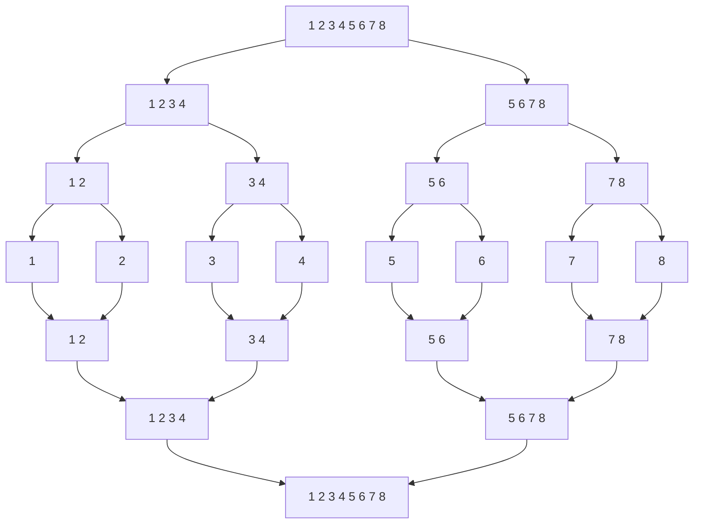

# Complexidade de algoritmos

- A quantidade de operações elementares depende da instância do problema.

- Busca - se definir a complexidade da pior instância.

- Complexidade de tempo: é o estudo do número de operações elementares executadas até sua conclusão.

- Complexidade de espaço: é o estudo da quantidade de memória necessária para resolver o problema.

- Comparar número de operações executadas por uma instância do problema pode levar a falsas conclusões.

## Ordens assintóticas

- A complexidade assintótica é definida pelo crescimento da complexidade para entradas suficientemente grandes.

> __*Def:*__ Sejam $f$ e $g$ funções reais. A função $g$ é uma cota assintótica superior (CAS) para $f$ se $\exist n_0 \in \N, \forall n \ge n_0 f(n) \le g(n)$ 

## Notação $O$

- Define uma cota assintótica superior

> __*Def:*__ $f$ é $O(g)$ se $\exist c \in \R; cg(n)$ é CAS para $f(n)$

- A notação $O$ elimina a necessidade de comparação de constantes multiplicativas.

- A análise sempre se baseia no pior caso.

### *Exemplo: Merge Sort*

## Análise de Complexidade Pessimista

- Critério de avaliação da complexidade do pior caso.

> __*obs:*__ Há outras análises de complexidade possíveis que não se baseiam na análise do pior caso. A análise amortizada é uma delas. 

## Análise da complexidade

### Sequência

A ordem da sequência é a soma das ordens das operações.

### Condicionais

__*Se b então S senão T*__. A complexidade da operação é o max($O(b), O(S), O(T)$).

### Iteração definida

__*Para i = 1 até m faça Q*__. A complexidade da operação é de $m\cdot O(Q)$.

### Iteração indefinida

__*Enquanto b faça S*__. Deve - se analisar cada caso.